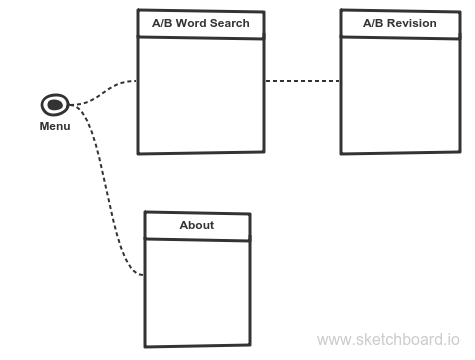
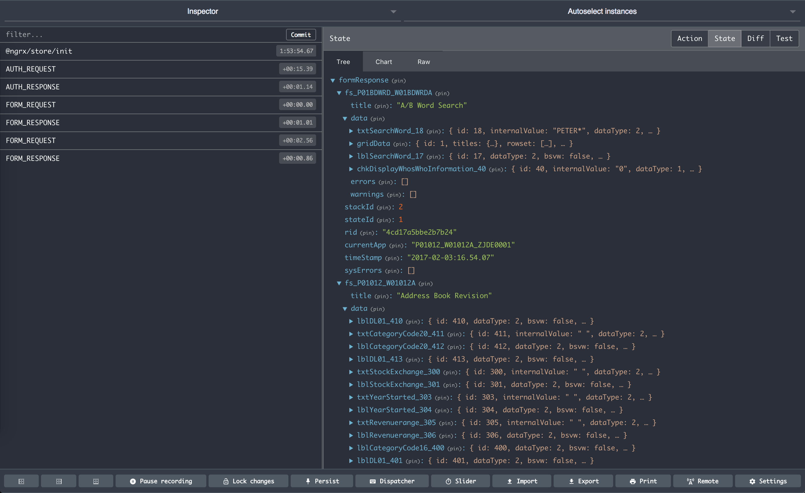

## Getting started with E1
A simple but fully fledged mobile E1 app build with the [Ionic Framework](http://ionicframework.com/docs/) that can be used as a starting point for new E1 app development.  
The key `Hello E1` features are:

* A basic Ionic framework with paging menu  
* The plumbings required for [Redux](http://redux.js.org) and [e1-service](https://www.npmjs.com/package/e1-service)  
* An About page that tests and stores the AIS url and optionally default user name and password  
* An A/B Word Search page that demonstrates search & select requests  
* An A/B Revision page that demonstrate inspect requests (read-only)  

<a href="https://itunes.apple.com/us/app/chelloe1/id1201175119?ls=1&mt=8" style="display:inline-block;overflow:hidden;background:url(//linkmaker.itunes.apple.com/assets/shared/badges/en-us/appstore-lrg.svg) no-repeat;width:135px;height:40px;background-size:contain;"></a>

<a href='https://play.google.com/store/apps/details?id=io.celin.helloe1&pcampaignid=MKT-Other-global-all-co-prtnr-py-PartBadge-Mar2515-1'></a>

### Prerequisite
First, have the latest recommended versions of [Node](https://nodejs.org) and [Visual Studio Code](https://code.visualstudio.com/download) installed.

Install Ionic (might need `sudo` or administrator permission):

```bash
$ npm install -g cordova ionic
```

### Installation
Download the [source code](https://github.com/Herdubreid/hello-e1/archive/v0.0.1.zip) and extract it into your project folder (hello-e1 is the original project folder name).  

In the project folder, type:

```bash
$ npm install
```

To test if the installation was successful, type:

```bash
$ ionic serve
```

This command will build the app and open it up in your default browser.

### Explore the code
To explore the code, open the project folder in Visual Code and expand the `src` folder, which is where our source code lives.

### The `app` folder
Let's start with a quick look at the `app` folder. This is where definitions and initialisation code for our app is stored (often referred to as the plumbings). The two files of interest are:

* `app.module.ts` : Contains definitions of modules, pages and providers for our app  
* `app.component.ts` : The closest thing to traditional `main` function, this is where initialisation normally takes place, such as menu definition

Once established, the content of the `app` folder is typically only changed if new components, like page or provider is added, or new initialisation is needed.

### The `pages` folder
The pages is where user interaction happens and subsequently the main functional area of our app.  
A page can be thought of like forms in E1, providing a certain functionality and interconnecting with other pages.



The menu, as defined in `app.components.ts`, controls what pages the user has access to.  
In our app, the user has only two pages to choose from, defined by:

```typescript
    this.pages = [
      { title: 'A/B Word Search', component: AbWordSearchPage },
      { title: 'About', component: AboutPage }
    ];
```

The opening page, called the `rootPage`, is set to either page depending on the whether the app has already been configured with AIS url or not.

#### The 'A/B Word Search' page
The 'A/B Word Search' is our main page, a search & select like E1 form that uses `P01BDWRD` at the back-end.  The page has only two functions:

* `search` : Monitor the search-box entry and once it has 3 or more characters, make `AbWordSearchRequest` to E1 (see E1 below for details).  
* `select` : Call the 'A/B Revision' page for the selected address number.

The remaining code monitors E1 response and presents it on the page.

#### The 'A/B Revision' page
This page uses `P01012_W01012A` at the back-end (and takes it name from it -- in case 'Revision' for a read-only page is confusing).  
The only function of the page is to make `AbRevisionRequest` to E1 and present the result.

#### The 'About' page
The about page is where we configure our AIS url and optional user name and password and its only function is to validate and save the url.

### The `storage` folder
Before getting to the `e1` stuff, let's quickly look at the `storage` folder.
Our storage requirement are quite simple, with the definition in `defs.ts` and related functions in `service.ts`.  
The storage concept is document oriented as opposite to tables and rows with simple `get` and `set` functions.  This makes perfect sense since a mobile app typically only needs to store configuration and intermittent data.  Any serious data-crunching is the responsibility of the back-end.  The speed of flash-storage should also make any complex database algorithms an overkill.  
There is one 'huh...' thing here though for anyone new to `Javascript`, and that's the peculiar `Promise` type.  I don't quite understand this myself, just starting to learn how to use it and putting my faith in all those `Javascript` people.

### The `e1` folder
This is where the interesting stuff is -- that is if you come from E1 development background.  
Let's look at the files one by one.

#### The `e1-helper` file
An E1 app can be in one of three authenticated state:

* Not authenticated yet (no AIS token)  
* Authentication timed-out (AIS token expired)
* Authenticated (valid AIS token)

To save us from having to test for the state every time we make a request, the `E1HelperService` does that for us, so we can boil our request to just a single statement.  For example, the `search` request of the 'A/B Word Search' page is:

```typescript
let search = new AbWordSearchRequest(searchEvent.target.value.trim() + '*');
this.form.request = search;
this.e1.call(this.form);
```

The first statement builds the request (see `ab-word-search` below) and the second assigns it to the `request` property of of the `FormService`, which is part of the `e1-service`.  
The last statement then passes the `FormService` to the `call` function of the `E1HelperService` -- and we're done.  
The 'A/B Revision' uses a slightly more elaborated statement:

```typescript
form.request = new AbRevisionRequest(this.row.mnAddressNumber_21.value);
e1.call(form, {
    success: () => {
        this.data = store
          .select<IAbRevisionFormData>('server', 'formResponse', 'fs_P01012_W01012A', 'data');
    }
});
```

The first statement builds the request as before (see `ab-revision` below) and assigns it (whether to combine the two into a single statement or not is a matter of preference, whatever is more readable does it for me).  
The `call` statement however has additional parameter that instructs it what to do once successful, which is to capture the `data` part of the response.  
This again is a syntax that might puzzle `Javascript` newbies -- and I'm talking from my own experience.  
To try to explain this, lets look at the `call` signature second parameter's type, which is:

```typescript
export interface IServiceCallback {
    success?: any;
    error?: any;
    done?: any;
}
```

This can be read as a 'class with optional three functions, `success`, `error` and `done`'.  The `call` function will in return call each of these function upon successful execution, error and when it's done.  
In fact, `Javascript` is full of these 'don't call me, I call you' patterns (`Promise` above is one of those).  And when you think it, this makes a lot of sense for a language that's designed to run on a single thread in a browser.  The last thing you want is for the user interface to 'hang' while waiting for some function to return, that again is waiting for a server to respond.  
I like to think of this as the 'agent concept' -- which anyone who has ever applied for a job through a recruitment agency should appreciate (helps alleviate the initial frustration when trying to understand this).

#### The `ab-word-search` file
This is the definition we need for the `P01BDWRD` request and subsequent response unpacking.  
Lets first look at the request:

```typescript
export class AbWordSearchRequest extends FormRequest {
    constructor(search: string) {
        super();
        this.formName = 'P01BDWRD_W01BDWRDA';
        this.formServiceAction = 'R';
        this.formActions = [
            {
                controlID: '18',
                command: 'SetControlValue',
                value: search
            },
            {
                controlID: 15,
                command: 'DoAction'
            }
        ];
    }
}
```

The `FormRequest` class we extend (or inherit) is packed with the most of the properties we need to make a form request.  At minimum we need to provide it with `.formName` and `.formServiceAction`  In addition we need to set the 'Word Search' parameter which is `controlID` 18 and then press the 'Find' button which is `controlID` 15.

The second definition is for the form response:

```typescript
export interface IAbWordSearchRow extends IRow {
    mnAddressNumber_21: IValue;
    sAlphaName_50: IValue;
    sPrefix_29: IValue;
    sPhoneNumber_30: IValue;
    sAddressLine1_31: IValue;
    sCity_32: IValue;
}

export interface IAbWordSearchResponse extends IFormResponse {
    fs_P01BDWRD_W01BDWRDA: IForm<IFormData<IAbWordSearchRow>>
}
```

We have a number of predefined interfaces like `IFormResponse`, `IForm`, `IFormData`, `IRow` and `IValue` that provide us with 'scaffolding'.  At minimum, we can define a form response as:

```typescript
export interface ISomeForm extends IFormResponse {
    fs_APP_FORM : IForm<IFormData<IRow>>
}
```

Where 'APP' is the application name and 'FORM' the form name.  The above definition doesn't say anything about the form or grid row fields we expect from the response.  To add a definition for grid row fields, we extend the `IRow` interface and replace it in the `IFormData<IMyGrid>` definition.  
It should be noted that the response definition is not a requirement, but more of a guard to verify that we are getting the response we expected and helpful when we need to access the members in `.ts` files (the `.html` just throws an error or ignores incorrect members).

####  The `ab-revision` file
There are couple of differences in the `P01012_W01012A` request and response to point out.  First lets look a the request:

```javascript
        this.formInputs = [
            {
                id: '12',
                value: ab
            }
        ];
```

We pass the address book number as a form input `id` 12.  We don't do any form actions, but rely on the form's logic to do the rest for us.

The second difference is that instead of grid row fields, we are now fetching form fields.  

```javascript
export interface IAbRevisionFormData extends IFormData<IRow> {
    txtAlphaName_28: IValue;
    txtAddressNumber_21: IValue;
    txtMailingName_38: IValue;
    txtSearchType_36: IExValue;
    txtABN_34: IValue;
    txtAddressLine3_44: IValue;
    txtAddressLine2_42: IValue;
    txtAddressLine1_40: IValue;
    txtCountry_56: IExValue;
    txtState_54: IExValue;
    txtCity_52: IValue;
    txtPostalCode_50: IValue;
    txtBusinessUnit_62: IExValue;
}

export interface IAbRevisionResponse extends IFormResponse {
    fs_P01012_W01012A: IForm<IAbRevisionFormData>
}
```

The difference is that instead of extending the `IRow` interface, we extend `IFormData` with a definition of the fields we are interested in.  

### Presenting the response
Finally, let's look at how we present the response.  
This is where Redux comes into play.  If you run the app in Chrome with the `Redux DevTools` extension, you should be able to see something like this:  
  
The response from our requests is kept in the Redux Store and we only need to add some code to extract the part we want to present.  The 'agent concept' is a perfect fit here because we're not interested until the data has arrived, and we use `Observer` type to look after this (think of it as the recruitment agent who waits by the phone for a prospective employer to respond -- and then lets us know).  
Our `ab-word-search` is only interested in the grid rows from `fs_P01BDWRD_W01BDWRDA` and this is how we access it:

```typescript
  rowset: Observable<IAbWordSearchRow[]>  // <-- declare an Observable member
...
    this.rowset = store
      .select<IAbWordSearchRow[]>(...GRID_DATA, 'rowset');  // <-- assign it to the grid rows
```

The `...GRID_DATA` is one of those clever `Javascript` syntax and it just says that we want to 'spread' the content of the `GRID_DATA` array, basically saves us from having to re-type:

```typescript
    this.rowset = store
      .select<IAbWordSearchRow[]>('server', 'formResponse', 'fs_P01BDWRD_W01BDWRDA', 'data', 'gridData', 'rowset');  // <-- assign it to the grid rows
```

Now we can open our `ab-word-search.html` file and fill in the presentation:

```html
    <button ion-item text-wrap *ngFor="let row of rowset | async" (click)="select(row)">
      <ion-label text-wrap>
        {{ "{{ row.sAlphaName_50.value "}}}}
      </ion-label>
      <div item-content>
        {{ "{{ row.mnAddressNumber_21.value "}}}}
      </div>
    </button>
```

The `*ngFor="let row of rowset | async"` statement is an [Angular](https://angular.io/docs/ts/latest/) `for` statement where it repeats the `<button>` element for every element of our `rowset` (remember our agent by the phone).  
The `| async` pipe syntax is needed to indicate that this an `asyncrhonous` variable.  
We then display the `sAlphaName_50` and `mnAddressNumber_21` values for each row.

The code for our `ab-revision` is similar with interest in different part of the response:

```typescript
        this.data = store
          .select<IAbRevisionFormData>('server', 'formResponse', 'fs_P01012_W01012A', 'data');
```

And the `ab-revision.html` presentation displays the `data` variable in similar way:

```html
     <ion-item>
      <ion-label stacked>
        Mailing Name
      </ion-label>
      <div item-content>
        {{ "{{ ( data | async )?.txtMailingName_38.value "}}}}
      </div>
    </ion-item>
```

The exception is:

```html
      <div item-content>
        {{ "{{ row.mnAddressNumber_21.value "}}}}
      </div>
      ...
      <div item-content>
        {{ "{{ row.sAlphaName_50.value "}}}
      </div>
```

The `row` member is a normal variable (no agent involved), that was passed from the `ab-word-search` page, so we don't need the `| async` pipe.

## Conclusion
This concludes my `Hello E1` introduction and I hope it has been informative.